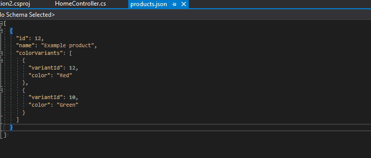
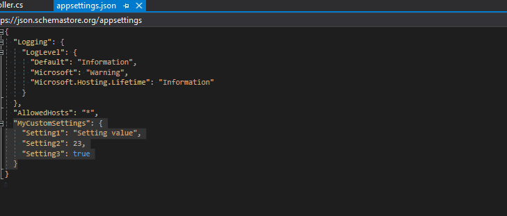

# JsonByExampleGenerator

 [](https://www.nuget.org/packages/JsonByExampleGenerator/) [](https://www.nuget.org/packages/JsonByExampleGenerator/) [](https://twitter.com/knifecore)

Generate classes based on example json files in your project. Uses a C# 9 source generator.

# Installation

1. Install the NuGet package in your project. Run the following command in the NuGet package manager console
```
Install-Package JsonByExampleGenerator
```
or using the .NET cli
```
dotnet add package JsonByExampleGenerator
```
2. Ensure the json files that you want to use as examples are added as `AdditionalFiles` in your `.csproj` file. E.g.:
```xml
<ItemGroup>
  <!-- Files must have the .json extension -->
  <AdditionalFiles Include="products.json" />
</ItemGroup>
```
3. You can now use the generated classes in your code. Add a using statement for `[your_dll_name_without_extension].Json.[path_to_json_csharp_friendly]`. E.g.:
```csharp
// For /mock_files/products.json
using MyCompany.MyProject.Json.MockFiles.Products;
```
Intellisense should help you out when adding a using statement for this. The complicated namespace is needed to ensure separation between different files.

# Example usage

## Use a json file to generate classes

[]

Given the following `products.json` file:
```json
[
  {
    "id": 12,
    "name": "Example product",
    "colorVariants": [
      {
        "variantId": 12,
        "color": "Red"
      },
      {
        "variantId": 10,
        "color": "Green"
      }
    ]
  }
]
```

You can then use the generated code as follows:

```csharp
var product = new Product()
    {
        Id = 16,
        Name = "Violin"
        ColorVariants = new List<ColorVariant>()
        {
            new ColorVariant()
            {
                VariantId = 17,
                Color = "Blue"
            }
        }
    };
```

## Get json configuration without the need for magic strings

[]

If you are using json configuration providers, you can do the following:

1. Ensure that the following NuGet packages are installed: `Microsoft.Extensions.Configuration.Json` and `Microsoft.Extensions.Configuration.Binder`.
2. Ensure that the `appsettings.json` (or any other configuration files) are included in the compilation as `AdditionalFiles` (as mentioned in the installation instructions). A typical example from your project file would look like this:
```xml
<AdditionalFiles Include="appsettings.json">
  <CopyToOutputDirectory>PreserveNewest</CopyToOutputDirectory>
</AdditionalFiles>
``` 

Now, given the following configuration file:
```json
{
  "AppSettings": {
    "exampleSetting": "example value"
  }
}
```

You would normally do this:
```csharp
// outputs "example value"
config.GetSection("Something").GetSection("SomeValue").Value
```
But now, you can do this:
```csharp
// outputs "example value"
Appsetting.FromConfig(config).Something.SomeValue
```

## Use your own Scriban template instead of the default one

If you have specific needs for the generated code, you can easily create a [Scriban](https://github.com/scriban/scriban) template to replace the default one. All you have to do is:
1. Create a file with the same name as your example json file, but with the extension `.sbntxt` instead of `.json`.
2. Ensure that the file is included in the `AdditionalFiles` for your project (the same way that you include your json files).
3. Copy the contents of the [default template](JsonByExampleGenerator.Generator/JsonByExampleTemplate.sbntxt), paste them in the file and save.
4. Change the template in any way you want, and you should observe the changes when you build your project.

If you want to change the code generation for all json files in a folder or the whole project (instead of adjusting for a single json file), you can use the following alternative step instead of step 1:
1. Create a file named `JsonByExampleTemplate.sbntxt` and place it in the folder where your json files are. If the template file is not there, the generator will go up one parent folder until it finds one (but will not go past the project root). Don't forget the other steps defined above.

There is also a template that is used to generate some global project code. If you want to change that, you can create a file named `OnlyOnceTemplate.sbntxt` in the root of your project. Make sure it is included in `AdditionalFiles`. Copy the contents of the default version [from here](JsonByExampleGenerator.Generator/OnlyOnceTemplate.sbntxt).

## Manually change the type or name of properties

Sometimes you may not like the name of the property or the type that is used. For example, if you want a `long` instead of an `int`. The generator has to guess, based on example data. And that may not always have the desired result.

You can fix this by specifying the property exactly how you want it in a partial class. Example:

Given the following `products.json` file:
```json
[
  {
    "id": 12,
    "name": "Example product"
  }
]
```

You can specify this partial class:

```csharp
namespace MyNs.Json.Products
{
  public partial class Product
  {
    // Based on the value of the name in the attribute, the generator knows not to generate this property
    [DataMember(Name = "id")]
    public long Id { get; set; } // Generates 'int' by default
  }
}
```

## Manually change the name of generated types

The generator automatically attempts to determine names for generated types. For example, if a json property is named "products", the model that will be used is `Product`. If you don't like that, you can easily change it by using the `JsonRenamedFrom` attribute.

Given the following `products.json` file:
```json
[
  {
    "id": 12,
    "name": "Example product"
  }
]
```

By default, it will render something like this:
```csharp
namespace MyNs.Json.Products
{
  [DataContract]
  public partial class Product
  {
    // ...
  }
}
```

You can specify this partial class:

```csharp
using MyNs.Json;

namespace MyNs.Json.Products
{
  [JsonRenamedFrom("Product")]
  public partial class Asset
  {
  }
}
```

The generator will respect the new name and change it in all generated code.